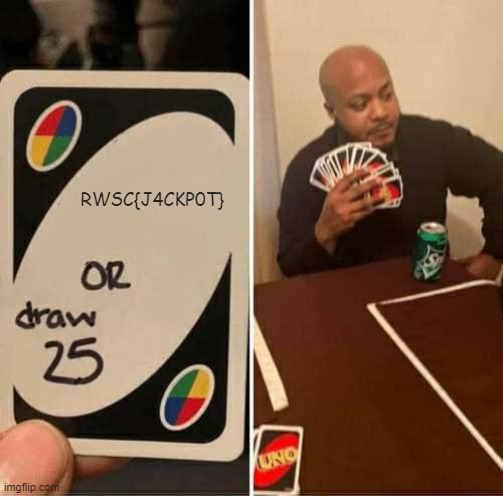

# Bring Your Own Script 
> Category: Web
## Solution

We are given a website that has multiple directories and the flag should be located in one of them. The script below is designed to visit directories on the website and continue scraping recursively until it finds ```RWSC``` inside the response.

```python
import requests
from urllib.parse import urljoin
from bs4 import BeautifulSoup
from urllib.parse import unquote


def scrape_website(url,output_file):
        try:
            response = requests.get(url)
            response.raise_for_status()
            soup = BeautifulSoup(response.text, 'html.parser')
            # print(response.text)
            with open(output_file, 'a', encoding='utf-8') as file:
                file.write(response.text)
                # Check if the target string is present
            if 'RWSC' in response.text:
                print(f"Found flag at {url}")
                exit()

            # Find all directories inside #directories .directory-link
            directories = soup.select('#directories .directory-link')
                
            # Extract and print the directory names
            for directory in directories:
                absolute_url = urljoin(url, directory['href'])
                print(f"Visiting: {unquote(absolute_url)}")
                scrape_website(absolute_url,output_file)

        except requests.exceptions.RequestException as e:
            print(f"Error accessing: {e}")

if __name__ == "__main__":
    # Replace 'http://example.com' with the URL of the website you want to scrape
    start_url = 'https://byos.ctf.rawsec.com/root/'
    output_file = "scraped.txt"
    scrape_website(start_url,output_file)

```

We didnt get any response that contains ```RWSC```. So, we need to search all the response stored inside ```scraped.txt```. Try every common file extension such as ```.txt```, ```.png``` and ```.jpg```.
```

```

Modify the script a bit to find JPG files.

```python
            if '.jpg' in response.text:
                print(f"Found flag at {url}")
                exit()
```

```
...
Visiting: https://byos.ctf.rawsec.com/root/🤤🤕😃/😔😁😕😵/😺😪🥴😇/😳🤕/index.php
Visiting: https://byos.ctf.rawsec.com/root/🤤🤕😃/😔😁😕😵/😺😪🥴😇/😳🤕/👾/index.php
Visiting: https://byos.ctf.rawsec.com/root/🤤🤕😃/😔😁😕😵/😺😪🥴😇/🥰🥶🤣😂/index.php
Visiting: https://byos.ctf.rawsec.com/root/🤤🤕😃/😔😁😕😵/😺😪🥴😇/🥰🥶🤣😂/😅/index.php
Visiting: https://byos.ctf.rawsec.com/root/🤤🤕😃/😔😁😕😵/😺😪🥴😇/🥰🥶🤣😂/😅😡/index.php
Visiting: https://byos.ctf.rawsec.com/root/🤤🤕😃/😔😁😕😵/😺😪🥴😇/🥰🥶🤣😂/🤧😅/index.php
Found flag at https://byos.ctf.rawsec.com/root/%F0%9F%A4%A4%F0%9F%A4%95%F0%9F%98%83/%F0%9F%98%94%F0%9F%98%81%F0%9F%98%95%F0%9F%98%B5/%F0%9F%98%BA%F0%9F%98%AA%F0%9F%A5%B4%F0%9F%98%87/%F0%9F%A5%B0%F0%9F%A5%B6%F0%9F%A4%A3%F0%9F%98%82/%F0%9F%A4%A7%F0%9F%98%85/index.php
```

We finally found the flag in https://byos.ctf.rawsec.com/root/%F0%9F%A4%A4%F0%9F%A4%95%F0%9F%98%83/%F0%9F%98%94%F0%9F%98%81%F0%9F%98%95%F0%9F%98%B5/%F0%9F%98%BA%F0%9F%98%AA%F0%9F%A5%B4%F0%9F%98%87/%F0%9F%A5%B0%F0%9F%A5%B6%F0%9F%A4%A3%F0%9F%98%82/%F0%9F%A4%A7%F0%9F%98%85/index.php


 
 

## Flag
The flag for this challenge is ```RWSC{J4CKP0T}```
