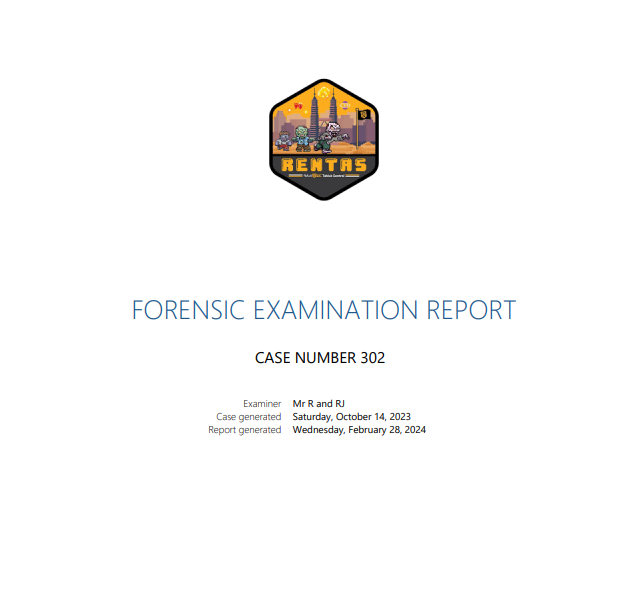

# Mobile

## Solution
For this challenge, we were give a PDF file, containing reports of forensic of the device, i.e. the Lenovo smartphone running on Android. The challenge asks us to find the password of the phone.


.PNG)


Simple search shows that password lock is stored in ```/data/system``` in SHA-1 format.<br>
https://www.forensicfocus.com/articles/android-forensics-study-of-password-and-pattern-lock-protection/#:~:text=The%20password%20lock%20file%20is,saves%20result%20into%20the%20file.


We got the SHA-1 hash, ```8e7e00c0bd5ce227f7be204c8b7c159669c776d4```. Now, we need to decrypt this hash into Android password.

Clone this repository to use decrypt python script.
https://github.com/Webblitchy/AndroidGestureCrack

```bash
python3 gesturecrack.py -r 8e7e00c0bd5ce227f7be204c8b7c159669c776d4
```
.PNG)
## Flag
The flag for this challenge is ```RWSC{875463120}```
